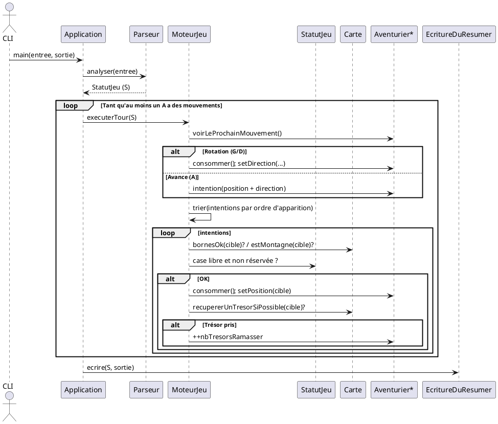

## KATA-CARTE-AUX-TRESORS 
Ce projet s’inspire du jeu 2048 que j’avais développé en C++ lors de mon DUT, ce qui m’a permis de réutiliser certaines logiques et concepts appris à l’époque.
### But

Lire un fichier d’entrée, simuler les déplacements d’aventuriers (tour par tour), ramasser les trésors (à **l’entrée** d’une case), puis écrire l’état final.

### Règles clés

* Carte rectangulaire, indexée (x: O→E, y: N→S).
* Montagnes = obstacles.
* Trésors : ramassage **1 par entrée** ; pour tout prendre, il faut repasser.
* Mouvements : `A` (avance), `G`/`D` (pivot 90°).
* Conflit d’arrivée même case → priorité à l’**ordre d’apparition**.

### Architecture (classes)

* `ParseurFichierEntree` : lit & valide (C/M/T/A) → `StatutJeu`.
* `MoteurJeu` : boucle des tours (rotations, intentions, résolution, pickup).
* `EcritureDuResumer` : écrit sortie (C, M, T restants, A).
* Domaine : `Carte`, `Position`, `Direction`, `Mouvement`, `Aventurier`, `StatutJeu`.

### Choix techniques

* Split robuste `\\s*-\\s*`, contrôles de colonnes, messages clairs.
* Résolution déterministe : tri par ordre d’apparition + set de cibles réservées.
* Stockage carte cohérent (ex. matrices `[y][x]`) + re-vérifs de bornes.

### Exécuter

```bash
mvn clean test package
java -jar target/carte-aux-tresors.jar <entree.txt> <sortie.txt>
```

### Tests

* Unitaires : parse, moteur (bord/montagne/collisions), écriture.
* End-to-end : exemple officiel (entrée → sortie attendue).

---

## Séquence d’un tour


merilb78@gmail.com